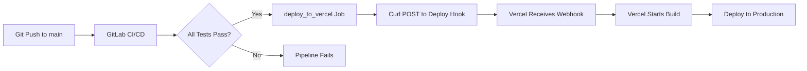

# 🚀 Deployment Pipeline Active!

## What Just Happened

**Commit Pushed**: `7b46f830` - "ci: Add automatic Vercel deployment to GitLab CI/CD pipeline"

**GitLab CI/CD Pipeline Starting**: The pipeline will now:

1. **Security Stage**
   - Secret detection
   - SAST (Static Application Security Testing)

2. **Test Stage**
   - Backend install
   - Backend build
   - Unit tests
   - Integration tests

3. **Build Stage**
   - Backend build
   - Smoke health check

4. **Deploy Stage** ⭐ NEW!
   - `deploy_to_vercel` job will trigger Vercel deployment
   - Runs automatically on `main` branch
   - Only runs if all previous stages pass

## Monitor Progress

### GitLab Pipeline
Watch the pipeline at: https://gitlab.com/xalchm/my_alchm/-/pipelines

**Expected timeline:**
- Security: ~2 minutes
- Test: ~3-4 minutes
- Build: ~2 minutes
- Deploy: ~30 seconds (to trigger Vercel)
- **Total**: ~7-8 minutes

### Vercel Deployment
Once GitLab deploy stage runs, check: https://vercel.com/gregcastro23s-projects/planetary-agents/deployments

**Expected:**
- New deployment will appear within 30 seconds of deploy stage
- Commit: `7b46f830`
- Build time: ~3-5 minutes
- Status: Queued → Building → Ready

## How It Works



## What Changed

### New CI/CD Job: `deploy_to_vercel`

```yaml
deploy_to_vercel:
  stage: deploy
  image: alpine:latest
  script:
    - curl -X POST 'https://api.vercel.com/v1/integrations/deploy/...'
  only:
    - main
  when: on_success
```

**Benefits:**
- ✅ Automatic deployment on every push to main
- ✅ Only deploys if tests pass
- ✅ Works even if GitLab webhook isn't configured
- ✅ Visible in GitLab pipeline logs
- ✅ Can be manually re-triggered from GitLab UI

## Verification Checklist

### 1. GitLab Pipeline (Now)
- [ ] Check pipeline started: https://gitlab.com/xalchm/my_alchm/-/pipelines
- [ ] Security stage passes
- [ ] Test stage passes
- [ ] Build stage passes
- [ ] Deploy stage runs successfully

### 2. Vercel Deployment (After ~7-8 minutes)
- [ ] New deployment appears in Vercel dashboard
- [ ] Commit matches: `7b46f830`
- [ ] Build completes successfully
- [ ] Site is live with latest changes

### 3. Live Site (After ~12-15 minutes total)
- [ ] Visit: https://planetary-agents.vercel.app
- [ ] Verify latest changes are deployed
- [ ] Test a few pages to ensure everything works

## Success Criteria

✅ **Pipeline Succeeds** = GitLab CI/CD completes all stages with green checkmarks

✅ **Vercel Deploys** = New deployment appears in Vercel dashboard with commit `7b46f830`

✅ **Site Updated** = planetary-agents.vercel.app shows latest changes

## If Something Fails

### GitLab Pipeline Fails
- Check the failed stage in GitLab pipeline view
- Read the job logs for error details
- Common issues: Test failures, build errors

### Vercel Deployment Doesn't Appear
- Check deploy_to_vercel job logs in GitLab
- Look for the curl response
- Should see: `{"job":{"id":"...","state":"PENDING",...}}`
- If error, deploy hook URL might need updating

### Vercel Build Fails
- Check build logs in Vercel dashboard
- Common issues: Missing env vars, build errors
- Can redeploy from Vercel dashboard

## Next Deployments

From now on, every push to `main` that passes tests will automatically deploy to Vercel!

**Workflow:**
1. Make changes locally
2. Commit and push to `main`
3. GitLab runs tests
4. If tests pass, GitLab triggers Vercel deployment
5. Vercel builds and deploys
6. Site goes live in ~10-15 minutes total

## Current Deployment

- **Previous live**: commit `4d28411` (3 days old)
- **Deploying now**: commit `7b46f830` (includes all agent enhancements!)
- **Includes**:
  - 52 enhanced agents with full data
  - All deployment documentation
  - Automatic CI/CD deployment
  - GitLab pipeline integration

## Timeline

- ⏰ **00:00** - Pushed commit `7b46f830`
- ⏰ **+02:00** - Security & test stages complete
- ⏰ **+05:00** - Build stage complete
- ⏰ **+07:00** - Deploy stage triggers Vercel
- ⏰ **+08:00** - Vercel starts building
- ⏰ **+12:00** - Vercel deployment complete
- ⏰ **+12:30** - Live site updated ✅

---

**Status**: 🟡 Pipeline Running

**Check pipeline progress**: https://gitlab.com/xalchm/my_alchm/-/pipelines

I'll monitor the pipeline and let you know once the Vercel deployment is triggered!
