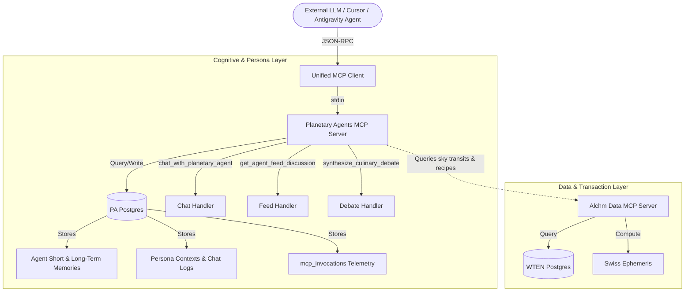

# Planetary Agents MCP Server Architecture

This document outlines the dual-database, Model Context Protocol (MCP) architecture powering the cognitive persona, astrological council, and telemetry layers of **Planetary Agents (PA)** and **Alchm.kitchen (Alchm)**.

---

## 🗺️ Architectural Topology

Our system implements a strict separation of concerns between transactional user-facing calculations (WTEN) and memory-retaining cognitive personas (PA), anchored by two separate databases and bridged by the Model Context Protocol.

---

## 🗄️ Database Separation

1. **PA Postgres (Cognitive Agent Anchor)**:
   - **Scope**: Manages agent long-term memories, conversational logs, RAG collections, and the newly added `mcp_invocations` table.
   - **Rationale**: Isolates cognitive and telemetric data to avoid bloating transactional tables in the web layer (WTEN).
2. **WTEN Postgres (Transactional Web Anchor)**:
   - **Scope**: Manages user profiles, alchemical token reserves (ESMS balances), and shopping cart integrations.

---

## 🛠️ MCP Server Tools & Gating

The PA MCP server exposes three primary tools over the Stdio transport channel:

### 1. `chat_with_planetary_agent`

- **Purpose**: Converse with an astrological persona.
- **Access**: Free to Reflective. Force-downgraded to `"free"` for anonymous callers.

### 2. `get_agent_feed_discussion`

- **Purpose**: Retrieve feed event discussions by thread ID.
- **Access**: Free.

### 3. `synthesize_culinary_debate`

- **Purpose**: Multi-agent discussion of ingredients, grounded in live planetary transits.
- **Access**: Premium (Alchemist). Standard or anonymous callers are downgraded to a single-persona stance.

---

## 📊 Telemetry, Gating & Observability

- **Prisma Schema Telemetry**: All tool calls are automatically logged to the `mcp_invocations` table in the PA Postgres database.
- **Background DB Logging**: Utilizes `asyncio.create_task` inside `backend/mcp_invocation_log.py` for fire-and-forget database writes, preventing database latency or failures from impacting tool execution.
- **Model-Tier Gating**: Intercepts arguments to validate API keys (against `DesktopApiKey` or `PA_USER_API_KEY`) and downgrade unauthorized/unpaid requests before dispatches.
- **Synthetic Probe**: An in-process cron route `/api/cron/synthetic-mcp-probe` exercises the tool handlers every 30 minutes, recording latency and status.
- **Admin Status**: `/api/admin/mcp-status` exposes a diagnostic summary of the latest probes to monitor health.

---

## 🧪 Testing

- **Mock Unit Tests**: `backend/tests/test_mcp_server.py` exercises the handlers and auth gating logic with a mocked backend database.
- **Stdio Integration Tests**: `backend/tests/test_mcp_stdio.py` (run with `PA_MCP_E2E=1`) spawns the subprocess and tests the standard stdio transport using JSON-RPC handshakes.
